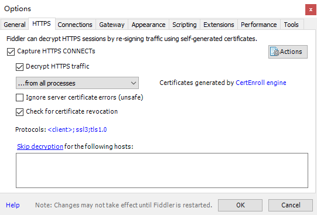
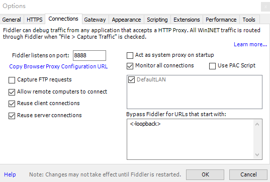
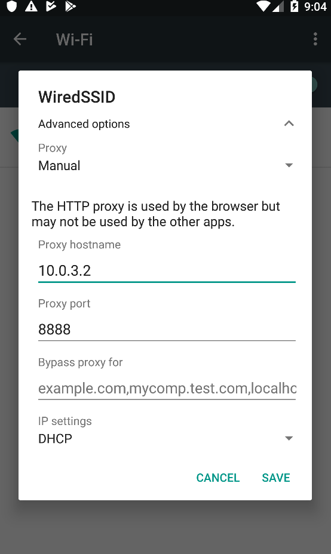
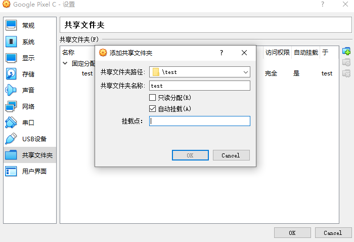
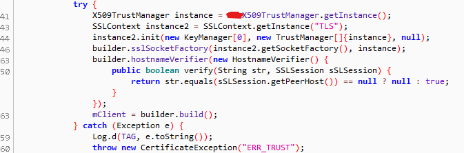
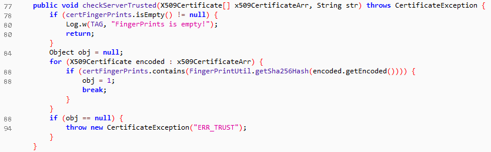
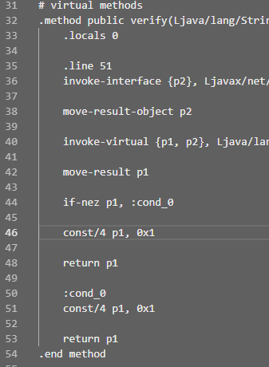
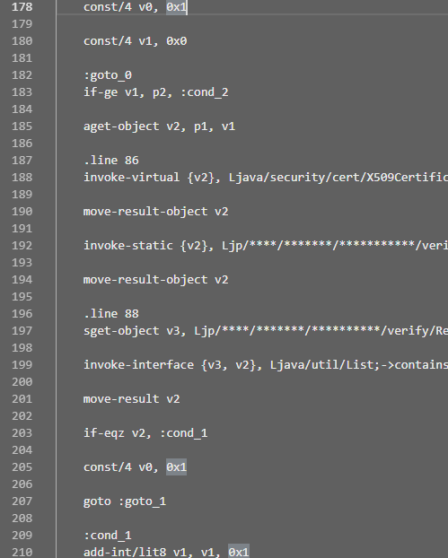

**以下情景均为杜撰。**

由于奇怪的需求需要对一款奇怪的Android应用进行抓包，虽然折腾半天成功抓到，但结果上确是没什么用，姑且记录一下。

## 配置简单的Android抓包环境

### 所需工具

* Android虚拟机：Genymotion个人版
* 抓包工具：Fiddler/Charles

### Android版本的选择

由于Android 7.0后，谷歌升级了安全策略，除系统证书外，用户添加的证书将不被信任，也就无法通过安装抓包工具签发的证书来抓取Https内容。当然，也可以通过root后安装相应xposed插件或自行将证书按规则添加到系统证书目录下来达到同样效果，但目标应用可以正常在6.0系统中运行，所以直接选择Android 6.0版本。

### Genymotion虚拟机的配置

目标应用需求使用Google套件，首次启动虚拟机后，使用Genymotion提供的Open GAPPS进行安装。重启后再下载对应版本ARM-Translation zip包刷入，再次重启。

### 抓包软件的配置

Fiddler和Charles配置大同小异，下面以Fiddler为例。

安装并打开Fiddler，Tools->Options打开配置窗口，HTTPS选项卡下勾选Capture HTTPS CONNECTs 及 Decrypt HTTPS traffic，Connections选项卡下，勾选Allow remote computers to connect。

同时，由于需要谷歌套件工作，需要在Gateway选项卡下，为Fiddler配置好可访问国际互联网的代理，Fiddler似乎不支持socks代理，也可使用proxifier等工具直接配置。

之后在Android的Wifi设置中，配置并连接到宿主机的Fiddler代理。

再打开Android中的浏览器应用，地址栏键入ipv4.fiddler:8888，点击FiddlerRoot certificate下载证书并安装，Credential use选择Wi-Fi。

如此，Fiddler就应该能够抓到普通应用的Https包并解码了。

然而，在启动目标应用后，并没有抓到预想的包，甚至不能正常登陆，这是怎么回事呢？

## 去除应用的HTTP公钥固定

很显然，从抓的唯一一个包看，应用从服务器请求了一段哈希值，很显然其采用了HPKP限制了证书，无法通过Fiddler的自签证书让其代理充当中间人解码Https内容了，要想绕过只有重新打包APK了。

### Apk拆包反编

已经有很成熟的工具了，这里使用整合的onekey-decompile-apk，下载解压，自行将_tool中的工具如apktool替换为新版即可，并修改bat中的相关命令。其中，framework.apk可于/system/framework中提取。Genymotion的Android虚拟机默认已root，在关机状态下通过VirtualBox配置挂载本地文件夹，再开机通过Root Explorer等软件拷贝到/mnt/shared/中的对应文件夹即可。

将目标应用apk拖到.bat文件上，将自动打开jadx-gui看到应用源码。十分幸运，目标应用代码基本没有混淆，很快定位到对应的类。

可以看到这里传入了自定义的X509TrustManager和Verifier，使得build出的okHttpClient对证书和主机名进行验证。自定义的X509TrustManager中，如果验证不成功则会抛出异常。

所以只需要让verify函数永远返回true，checkServerTrusted函数中obj永远为1，不抛出异常即可。

### 修改smali文件

一键的脚本默认会直接生成源码，但我们现在需要的是修改smali文件中的对应部分并重新打包，所以使用`java -jar .\_tools\apktool\apktool_2.4.0.jar d -p ./_tools/framework -t t target.apk`命令，重新解包。在smali文件夹中，很简单地找到对应位置的smali文件，将两处赋值语句，由`0x0`更改为`0x1`并保存。

接着使用命令`java -jar .\_tools\apktool\apktool_2.4.0.jar b -p ./_tools/framework -t t target -o target.apk`重新封包apk。

然后通过命令`jarsigner -verbose -sigalg SHA1withRSA -digestalg SHA1 -keystore app.keystore target.apk app`，使用jdk自带工具，将apk重新签名即可。若没有已生成的keystore文件，可以使用`keytool -genkey -v -keystore test.keystore -keyalg RSA -keysize 2048 -validity 10000 -alias app`命令创建一个。

最终，卸载掉Android虚拟中原来的目标应用，拖入我们新生成的apk安装，就可以正常抓包了。

> 此处应该有图

那么问题来了，如果我只想看个接口，都有源码了，为什么还要再抓包呢？

